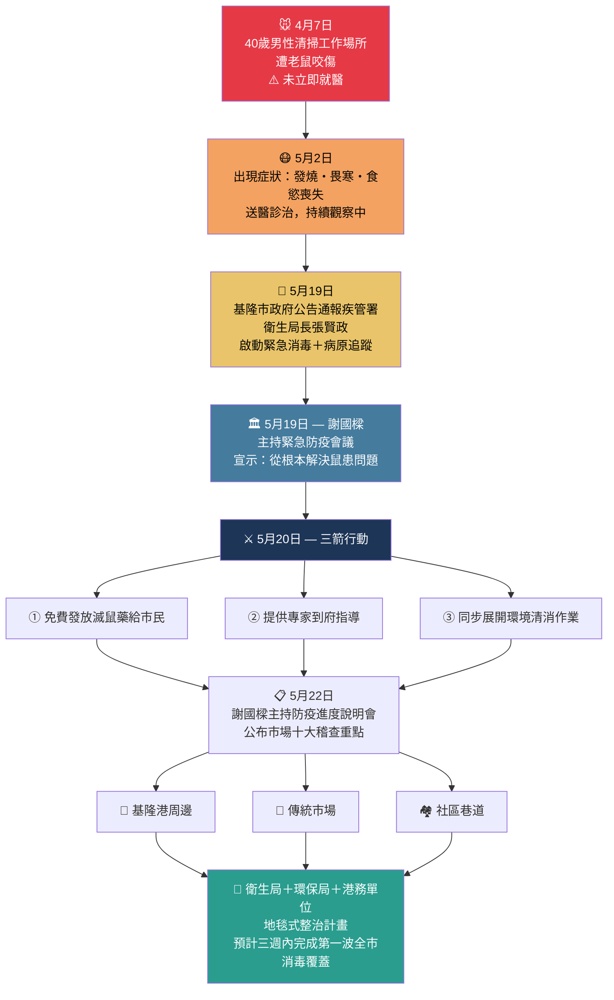
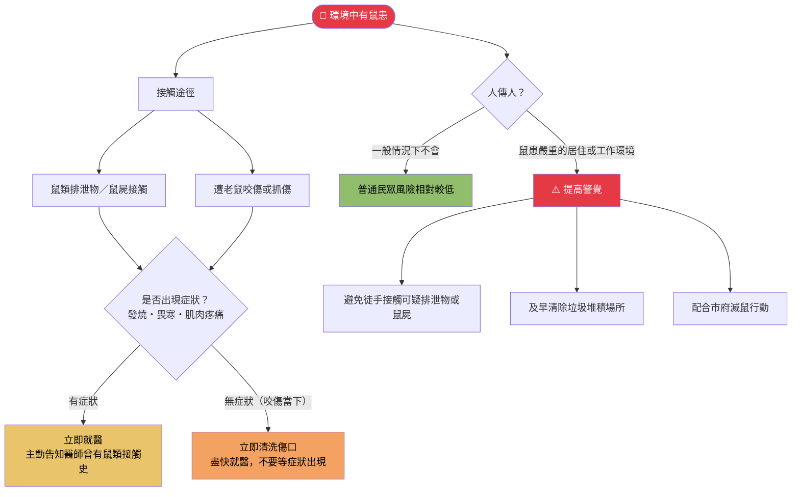
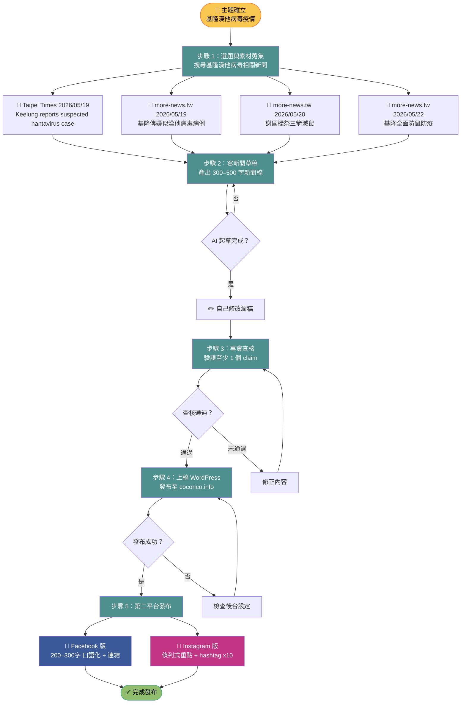

# 新聞專題 Pipeline 流程圖
## 主題：基隆漢他病毒疫情（2026年5月）

---

## 圖零：文章內容視覺化

### 0-A　事件發展時序 × 政府回應



### 0-B　漢他病毒傳播路徑與民眾防護決策樹



---



## 工具與負責人對照

| 步驟 | 工具 | 負責人 |
|------|------|--------|
| 1. 選題與素材蒐集 | Kiro | AI + 自己確認 |
| 2. 寫新聞草稿 | Kiro | AI 起草，自己修改 |
| 3. 事實查核 | Google + Kiro | 自己做 |
| 4. 上稿 WordPress | WordPress 後台 | 自己操作 |
| 5a. FB 發布 | Facebook | 自己操作 |
| 5b. IG 發布 | Instagram | 自己操作 |

---

## Instagram 發布內容（實際產出）

> 對應步驟 5b，以下為實際發布的 IG caption：

```
⚠️ 基隆出現疑似漢他病毒病例

一名40歲男性4月遭老鼠咬傷
25天後出現發燒、畏寒、食慾不振
確認通報疾管署 🏥

市長謝國樑緊急宣布三大措施 👇
✅ 免費發放滅鼠藥
✅ 專家到府指導
✅ 全市環境清消啟動

基隆港、傳統市場、社區
衛生局 × 環保局 × 港務單位
全面展開地毯式整治 🐀❌

─────────────────
🔬 漢他病毒小知識
主要透過接觸鼠類排泄物或被咬傷傳播
✋ 不會人傳人
被老鼠咬到請立即清洗傷口並就醫！
─────────────────

#基隆 #漢他病毒 #公共衛生 #滅鼠
#Hantavirus #基隆港 #謝國樑
#防疫 #台灣新聞 #健康資訊
```
